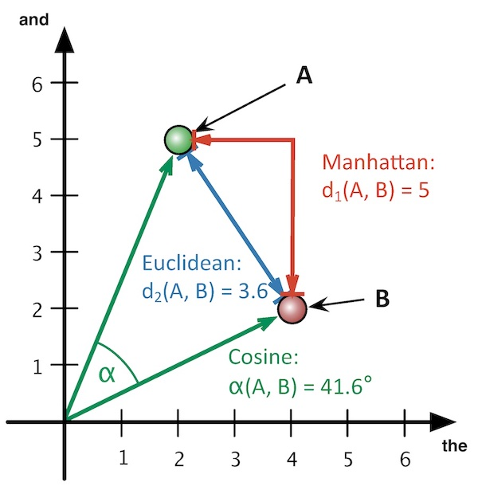

# Stylometry with R: Authorship attribution

- Definition
- Authorial fingerprint
- Requirements
- Hands-on example with `stylo` in R

## Definition

Stylometry is the quantitative, computational study of (literary) style.

- Discipline: Digital Literary Stylistics, Computational Literary Studies, Computational Stylistics

- Text Analysis of **authors and writing**: attribution of authorship; intertextuality; text-reuse; sentiment analysis; topic modelling; author profiling (gender, age range, native language); character networks; NLP with literary text.

- Distant analysis: textual genres; literary canon and movements, etc. (John Burrows, Franco Moretti, Matthew Jockers, Ted Underwood)

- Leon Batista Alberti (1404–1472)

## Authorship attribution

Determining the authorship of an anonymous text, or to solve a controversial authorship.

### Distinct contexts 

- closed-set context: the real author is one of the candidates within the sample of documents.
- open-set context: possible author or unknown one.
- verification: samples of unique candidates vs. test document

- Detection of fabricated stories.
- Collaborative writing (e.g. theater plays).

### A bit of History

- Lorenzo Valla (15th C.), _Donation of Constantine_

- Wincent Lutosławski (1897), _metoda stylometryczna_

- Thomas C. Mendenhall (1901), Shakespeare authorship argument

- Mosteller and Wallace (1964), The Federalist Papers


## Authorial fingerprint

- Stylistic fingerprint: "Le style c’est l’homme"
- **Function words** (prepositions, pronouns, determiners, ...)


## Requirements

### Some analysis tools

- [`stylo`](https://github.com/computationalstylistics/stylo) package in R (Eder, Rybicki, Kestemont 2016)
- Python libraries (see, e.g.: Karsdorp, Kestemont and  Riddell, "[Stylometry and the Voice of Hildegard](https://www.humanitiesdataanalysis.org/stylometry/notebook.html)", _Humanities Data Analysis: Case Studies with Python_, Princeton University Press, 2021. 
- [JGAAP](http://evllabs.github.io/JGAAP/) (Java Graphical Authorship Attribution Program), (Juola 2005)

### Digital Texts
- txt, xml
- extracted features: e.g. words
- number of features: 500 MFW 
- author-based corpus
- text size: 2000-5000 words
- text noise: not (so) relevant

### MFW (**M**ore **F**requent **W**ords)


### Author-based corpus

Texts as similar as possible, in period, in genre, etc. 

### Text Size

“the minimal sample size can be lowered substantially, from ca. 5,000 running words as suggested previously (Eder, 2015),to less than **2,000 words**. However, this is true only for those texts that exhibit a **clear authorial signal**; otherwise the risk of severe misclassification appears.” (Eder, 2017: 3)


_The Ambassadors_ by Henry James compared against a corpus of 100 English novels (Eder 2017)


_Bleak House_ by Charles Dickens (Eder 2017)

### Noise in Text

- The absolute cleanliness of the text produced by OCR or HTR is not an essential condition for authorship attribution (Franzini et al. 2018)

- Paratexts: dedication, acknowledgements, opening information, didascalias, character names in Theater plays

```XML
<stage>(Sale MOSCATEL.)</stage>
<sp who="#moscatel">
<speaker rend="caps">Moscatel</speaker>
<lg>
    <l>¿Que no? Luego</l>
    <l>si yo a tener amor llego</l>
    <l>noble será mi pasión.</l>
</lg>
</sp>
<sp who="#don-alonso">
    <speaker rend="caps">Don Alonso</speaker>
<lg>
    <l>¿Tú amor?</l>
</lg>
</sp>
<sp who="#moscatel">
<speaker rend="caps">Moscatel</speaker>
<lg>
    <l>Yo amor.</l>
</lg>
</sp>
```
calderon_NoHayBurlasConELAmor.txt

``` TXT
¿Que no? Luego
si yo a tener amor llego
noble será mi pasión.
¿Tú amor?
Yo amor.
...
```
### Distance measures 

The difference in the use of words between texts: the smaller the distance, the greater the similarity.

**Text A**
> **The** boy could not resist **the** temptation of sweets **_and_** took marshmallows **_and_** liquorice **_and_** lollipops **_and_** candied fruit **_and_** chocolates.

**Text B**
> **The** sun was setting, **_and_** **the** birds were singing their evening song. **The** gentle breeze rustled **the** leaves, **_and_** a distant sound of children playing could be heard.



Modified [image](https://www.zfdg.de/sites/default/files/medien/delta_2016_003.png) from Büttner et al. 2017, CC-BY  

### Methods

#### Cluster Analysis


#### Consensus Tree


#### Network Analysis


## `stylo` package in R

It computes distances (differences) between texts and plots graphs of those distances.

- [Computational Stylistics Group](https://computationalstylistics.github.io), based in Kraków.

- Eder, M., Rybicki, J. and Kestemont, M. (2016). _Stylometry with R:
    a package for computational text analysis_. R Journal 8(1): 107-121.
    <https://journal.r-project.org/archive/2016/RJ-2016-007/index.html>

## Hands-on examples

- Install R and Rstudio
- Download this repository (code > download zip) in your computer (notice the path to the folder)
- Run Rstudio
- Install `stylo`

### stylo_basic.R

- Using stylo with a GUI
- General overview

### stylo_firstSteps.R

- No GUI
- unattributed text
- Consensus Tree
- Distance Table
- Closed set or open-set

### stylo_network.R

- Networks on big corpora

### Extra corpora

[A Short Collection of British Fiction](https://github.com/computationalstylistics/A_Small_Collection_of_British_Fiction)

[100 English Novels](https://github.com/computationalstylistics/100_english_novels)

# References

Büttner, Andreas, Friedrich Michael Dimpel, Stefan Evert, Fotis Jannidis, Steffen Pielström, Thomas Proisl, Isabella Reger, Christof Schöch, and Thorsten Vitt. 2017. “»Delta« in der stilometrischen Autorschaftsattribution.” _ZfdG - Zeitschrift für digitale Geisteswissenschaften_ 2. https://doi.org/10.17175/2017_006.

Eder, Maciej. 2015. “Does Size Matter? Authorship Attribution, Small Samples, Big Problem.”_ Digital Scholarship in the Humanities_ 30 (2): 167–82. https://doi.org/10.1093/llc/fqt066.

Eder, M., Rybicki, J. and Kestemont, M. (2016). _Stylometry with R: a package for computational text analysis_. R Journal 8(1): 107-121. <https://journal.r-project.org/archive/2016/RJ-2016-007/index.html>

Eder, Maciej. 2017. “Short Samples in Authorship Attribution: A New Approach.” In Digital Humanities 2017: Conference Abstracts, 221–24. Montreal: McGill University. https://dh2017.adho.org/abstracts/341/341.pdf.

Eder, Maciej. 2017. “Visualization in Stylometry: Cluster Analysis Using Networks.” _Digital Scholarship in the Humanities_ 32 (1): 50–64. https://doi.org/10.1093/llc/fqv061.

Franzini, Greta, Mike Kestemont, Gabriela Rotari, Melina Jander, Jeremi K. Ochab, Emily Franzini, Joanna Byszuk, and Jan Rybicki. 2018. “Attributing Authorship in the Noisy Digitized Correspondence of Jacob and Wilhelm Grimm.” _Frontiers in Digital Humanities_ 5 (April): 4. https://doi.org/10.3389/fdigh.2018.00004.

Savoy, Jacques. 2020. _Machine Learning Methods for Stylometry: Authorship Attribution and Author Profiling_. Cham: Springer International Publishing. https://doi.org/10.1007/978-3-030-53360-1.
